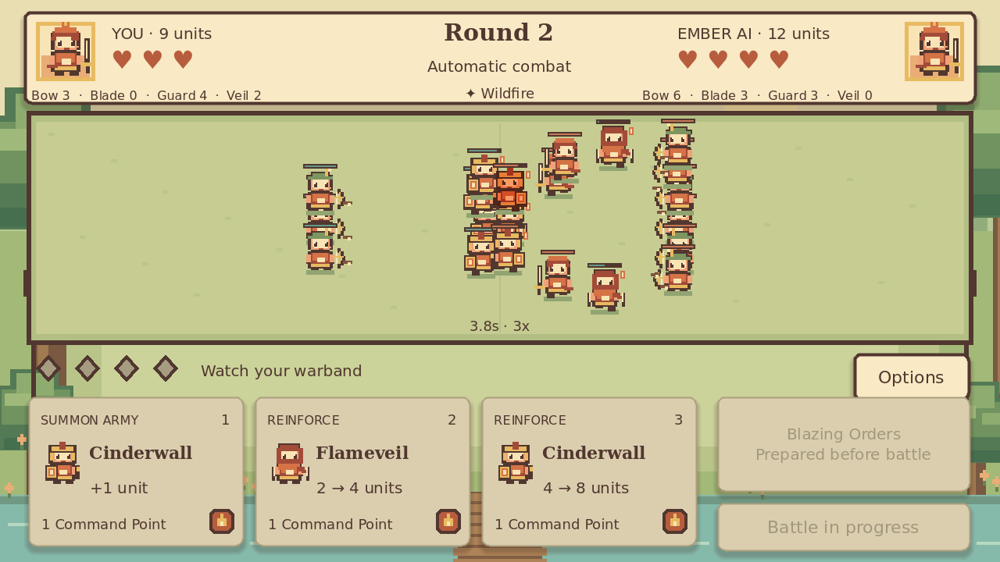

# VTuber Era

A cozy storybook drafting auto-battler, set at the Convergence Festival.
Command a Fire Warband against a fair AI, then watch your armies trade magical
sparks in a sunny woodland clearing. This is a playable Phase 1 vertical slice.



**Play online:** [Launch VTuber Era](https://oaklanavery-hub.github.io/vtuber-era/)
**Source:** [oaklanavery-hub/vtuber-era](https://github.com/oaklanavery-hub/vtuber-era)

## Play and controls

Choose the Fire Commander and confirm the four-card Fire Warband. Both sides
start with four Hearts. Spend three Command Points before each automatic battle;
the previous loser gets a fourth, teal comeback rune next round.

Each point summons an offered army, doubles an eligible army through
Reinforcements, promotes an eligible army, or prepares Blazing Orders. Special
army cards require two normal summons of that type. Rank and unit counts persist;
units return at full HP after combat. The first side to lose all Hearts loses.

| Control | Action |
|---|---|
| Mouse / touch | Select buttons and offered cards |
| 1, 2, 3 | Choose the corresponding offer |
| B | Prepare Blazing Orders before combat |
| Space | Begin automatic combat; unused points are discarded |
| Enter | Confirm Reinforcements or advance the round dialog |
| Escape | Settings during a battle; back from other screens |
| F3 | Toggle explanations of AI draft choices |

During combat, commands are locked. Settings pause the visual match while open;
combat speed changes how quickly fixed simulation ticks are displayed.

## Required engine and editor

Use **Godot 4.5 stable**, standard build, GDScript, Compatibility renderer.
The exact build is `4.5.stable.official.876b29033`.

1. Download the standard engine from the [Godot 4.5 archive](https://godotengine.org/download/archive/4.5-stable/).
2. Import `project.godot` in the project manager.
3. Open the project and press **F6** on `scenes/main.tscn`, or **F5** to run.

Editor previews are for development. The shipping platform is the browser.
No desktop or mobile package is part of this project.

## Tests

Run from the project directory with `godot` pointing to Godot 4.5:

```sh
godot --headless --path . --editor --import --quit
godot --headless --path . --script res://tests/run_tests.gd
godot --headless --path . --script res://tests/ui_smoke.gd
```

The rules runner exits non-zero on failure and covers point costs, eligibility,
caps, offers, AI legality, seeded replay, fixed-tick independence, combat effects,
Hearts, resets, time limits and malformed settings. The UI smoke runner exercises
screen transitions, actual summoning, spell preparation, combat, results and
Rematch. `QA_REPORT.md` records validation of this release.

For optional browser QA, install Playwright locally (it is not a game runtime
dependency): `npm install --no-save --package-lock=false playwright`, then
`npx playwright install chromium` and `node tests/browser_smoke.cjs` after export.
It serves the build itself at `/vtuber-era/`, plays a complete match, checks
settings across reload, verifies real draft actions and captures screens. Add
`?qa=1` to a development URL to enable its read-only `window.vtuberEraQA` snapshot.

## Export and test the browser build

Install matching **4.5 stable export templates** through Godot's Export Template
Manager. The Web preset disables threads and GDExtensions and uses the WebGL 2
Compatibility renderer. Logical resolution is 640×360 with a preserved 16:9
aspect ratio and nearest-neighbour textures.

```sh
mkdir -p build/web
godot --headless --path . --export-release Web build/web/index.html
python3 tools/prepare_web.py
python3 tools/serve_web.py
```

Open `http://localhost:8000/vtuber-era/`. On Windows, use `python` in place of
`python3`; create `build/web` in Explorer or with `mkdir build\web` first.
The export must be served over HTTP/HTTPS, not opened as `file://`.

The separate Web ZIP includes a local server and Windows launcher. A browser
with WebAssembly and WebGL 2 is required. No custom cross-origin headers, account,
CDN, runtime JavaScript game framework or remote asset service is needed.

## Public GitHub and Pages

The public source repository is
[oaklanavery-hub/vtuber-era](https://github.com/oaklanavery-hub/vtuber-era), with
`main` as its default branch. The browser release is live at
[oaklanavery-hub.github.io/vtuber-era](https://oaklanavery-hub.github.io/vtuber-era/).

The included `.github/workflows/deploy-pages.yml` installs the exact engine and
templates, verifies official SHA-512 checksums, imports resources, runs both
GDScript runners, exports, checks required files, adds notices and `.nojekyll`,
and deploys using the official Pages actions. It runs on `main` pushes or manual
dispatch. Only contents-read, Pages-write and ID-token-write permissions are
requested; concurrent deployments are serialized with cancellation of older
runs. The first public build and deployment completed successfully on
5 October 2026.

## Project structure

| Folder | Responsibility |
|---|---|
| `data/` | Custom Godot Resources and editable Fire content |
| `simulation/` | Persistent match rules, points, Hearts, seeded RNG |
| `drafting/` | Weighted, unique offers and special-card eligibility |
| `combat/` | Deterministic movement, attacks, projectiles and Burn |
| `ai/` | Legal choice scoring from a frozen opponent snapshot |
| `scenes/` | Main scene and independent Node2D world/battlefield rendering |
| `ui/` | Control-node screens, cards, modals and glowing runes |
| `autoloads/` | Versioned settings and original audio playback |
| `assets/` | Original sprites, portrait, audio and third-party notices |
| `tests/` | Headless rules, UI and optional browser QA |
| `tools/` | Rebuild assets, finish/serve exports and browser smoke testing |

## Limits and next work

- One placeholder Commander and four Fire armies; no final VTuber identities.
- Placeholder art and synthesized festival music, intended for replacement.
- No Water/Earth gameplay, multiplayer, accounts, monetization or manual formation.
- Balance is an initial tuning pass, not a competitively balanced release.
- Rare simultaneous dispersal is an announced draw with no Heart loss. Exact
  timeout ties enter escalating sudden death first.
- A full roster can display capped normal cards as disabled; no free reroll is
  granted. Remaining points can be discarded by starting combat.
- Settings and the last Fire setup are saved locally; ongoing matches are not.
- Browser data restrictions or private browsing can prevent settings persistence.
- Browser smoke testing covers Chromium; Safari, Firefox and mobile testing remain.

## Licence status

**No open-source licence has been selected. Public source visibility does not
grant reuse rights.** Permission from the project owner is required for reuse of
project code or original assets. Third-party font and engine licences remain
separate and are included in `assets/` and the Web export's
`THIRD_PARTY_NOTICES.txt`. See `ASSET_GUIDE.md` for provenance.
