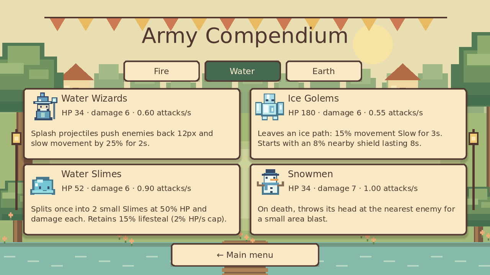

# VTuber Era

A cozy storybook drafting auto-battler at the Convergence Festival. Choose a
Fire, Water or Earth Commander and four unique armies from twelve cards. Phase 2
adds mixed warbands, healing, shields, Slow, lifesteal and siege splash.

The creature-army update adds twelve distinct animated designs, permanent solid
unit collision, side-stepping around blocked approaches and a compact battle HUD.
The battlefield is now 600×202, about 52% more area than the previous 560×142.

The latest update uses smooth DejaVu Sans text and adds all twelve army passives:
projectile splash and pushback, death explosions and Slime splitting, one-use
Ninja resurrection, flame walls, ice paths, Tree healing, Armadillo attack Slow,
split arrows and huge siege blasts. The compendium explains each ability.
Collision stays active at 7.2×7.2 with depth-sorted sprites, a compact HUD and
twelve original combat sound effects.



**Play:** [Launch VTuber Era](https://oaklanavery-hub.github.io/vtuber-era/)
**Source:** [oaklanavery-hub/vtuber-era](https://github.com/oaklanavery-hub/vtuber-era)

## Play and controls

Choose any Commander, use a realm preset or mix four different army cards, and
choose a Mirror, Fire, Water or Earth AI rival. Four cards from one realm activate
that realm's bond, independently of your Commander. Both sides start with four
Hearts and three Command Points; the previous loser gets one comeback point.

Each point summons an offered army, reinforces an eligible army, promotes its
Rank, or prepares your Commander's spell. Specials require two normal summons.
Counts and Ranks persist; units return at full HP after each automatic battle.
The first side to lose all four Hearts loses. No commands are allowed in combat.

| Control | Action |
|---|---|
| Mouse / touch | Select Commanders, army cards and buttons |
| 1, 2, 3 | Choose the corresponding draft offer |
| B | Prepare your Commander's spell before combat |
| Space | Begin battle; unused points are discarded |
| Enter | Confirm Reinforcements or advance a round dialog |
| Escape | Open settings during a battle; go back elsewhere |
| F3 | Show AI draft explanations |

Settings pause the visual match while open. Combat speed changes how quickly
fixed simulation ticks are displayed. Settings, Commander, warband and rival
save locally. Version 1 saves migrate automatically; ongoing matches do not save.

## Engine and editor

Use **Godot 4.5 stable**, standard GDScript build and Compatibility renderer.
The exact build is `4.5.stable.official.876b29033`.

1. Download the [Godot 4.5 standard engine](https://godotengine.org/download/archive/4.5-stable/).
2. Import `project.godot` in the project manager.
3. Press **F5**, or **F6** on `scenes/main.tscn`.

The shipping platform is the browser; editor previews are for development.

## Tests

Run from the project directory with `godot` pointing to Godot 4.5:

```sh
godot --headless --path . --editor --import --quit
godot --headless --path . --script res://tests/run_tests.gd
godot --headless --path . --script res://tests/elemental_tests.gd
godot --headless --path . --script res://tests/passive_tests.gd
godot --headless --path . --script res://tests/formation_tests.gd
godot --headless --path . --script res://tests/ui_smoke.gd
```

The rules runner covers economy, eligibility, offers, caps, persistence, Hearts,
Fire effects, AI legality, deterministic replay, time limits and malformed saves.
The elemental runner checks all Commanders, mixed loadouts, shields, healing,
lifesteal, Slow, splash and complete deterministic matches across all nine realm
pairings. UI smoke exercises selection, real drafting, combat, results and Rematch.
All runners exit non-zero on failure. See `QA_REPORT.md` for release evidence.
The formation runner covers 144-unit crowds, duplicate-role mixed spawns, body
collision throughout movement and interpolation, allied/hostile detours, melee
contact, range-based pursuit, original stats and deterministic movement replay.
The passive runner covers all twelve abilities, simultaneous death chains,
posthumous projectiles, one-use revivals/splits, non-stacking slows, exact damage
and healing fractions, timed auras, pushback collisions and 240-unit split crowds.

Optional balance sampling runs 72 full AI matches:

```sh
godot --headless --path . --script res://tests/balance_simulations.gd
```

For optional browser QA, install Playwright locally (not a game dependency):
`npm install --no-save --package-lock=false playwright`, then
`npx playwright install chromium`. After exporting, run
`node tests/browser_smoke.cjs`. Set `QA_REALM` to `fire`, `water`, `earth` or `mixed`,
and optionally `QA_RIVAL` to the opposing realm. Each scenario plays a full match,
checks saved settings/loadouts, verifies real actions and captures screenshots.
On Windows, set the variables before running Node. A development URL with `?qa=1`
enables the opt-in, read-only `window.vtuberEraQA` snapshot.

## Export the browser build

Install matching **4.5 stable export templates** through Godot's Export Template
Manager. The Web preset disables threads and GDExtensions and uses WebGL 2.
The logical resolution is 640×360 with preserved 16:9 and nearest filtering.

```sh
mkdir -p build/web
godot --headless --path . --export-release Web build/web/index.html
python3 tools/prepare_web.py
python3 tools/serve_web.py
```

Open `http://localhost:8000/vtuber-era/`. On Windows, use `python` instead of
`python3` and create `build/web` first. Serve the export over HTTP/HTTPS.
A browser with WebAssembly and WebGL 2 is required. No custom isolation headers,
account, CDN, remote asset service or JavaScript game framework is needed.

## GitHub Pages

`.github/workflows/deploy-pages.yml` installs the exact engine/templates,
verifies official SHA-512 checksums, imports, runs all five correctness runners,
exports, checks required files, includes notices and `.nojekyll`, then deploys
through official Pages actions. Main pushes and manual dispatch trigger it.
The public game uses the existing `/vtuber-era/` project path.

## Project structure

| Folder | Responsibility |
|---|---|
| `data/` | Custom Resources: twelve armies, three Commanders/bonds and balance |
| `simulation/` | Persistent armies, points, Hearts and seeded draft RNG |
| `drafting/` | Unique weighted offers and special eligibility |
| `combat/` | Fixed-tick movement, projectiles, splash and elemental effects |
| `ai/` | Legal scoring from frozen opponent information |
| `scenes/`, `ui/` | World/battlefield rendering, selection, cards and dialogs |
| `autoloads/` | Versioned local saves and original audio |
| `assets/` | Original atlases, three portraits, audio and licence notices |
| `tests/` | Rules, elemental, passives, formation, UI, browser and balance runners |
| `tools/` | Rebuild assets and prepare/serve exports |

## Current limits

- Placeholder portraits, pixel art and synthesized music; no final VTuber identities.
- Initial prototype balance; the AI sample does not establish competitive balance.
- No multiplayer, accounts, monetization, manual formation or native package.
- Rare simultaneous dispersal is a draw with no Heart loss. Exact timeout ties
  enter escalating sudden death.
- Capped normal cards can remain visible but disabled; no free reroll is granted.
- Private browsing or storage restrictions can prevent local saves.
- Browser QA covers Chromium; Firefox, Safari and mobile validation remain.

## Licence status

**No open-source licence has been selected. Public source visibility does not
grant reuse rights.** Permission from the owner is required for project code or
original assets. Engine/font licences remain separate and are included in
`assets/` and the Web export's `THIRD_PARTY_NOTICES.txt`. See `ASSET_GUIDE.md`.
