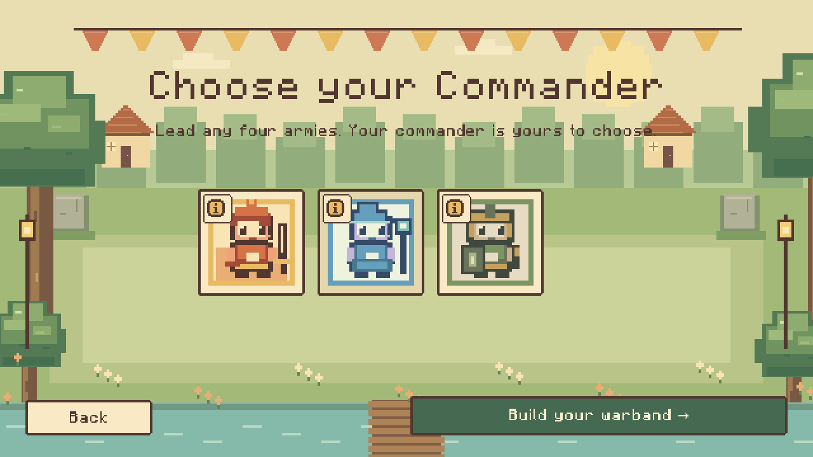
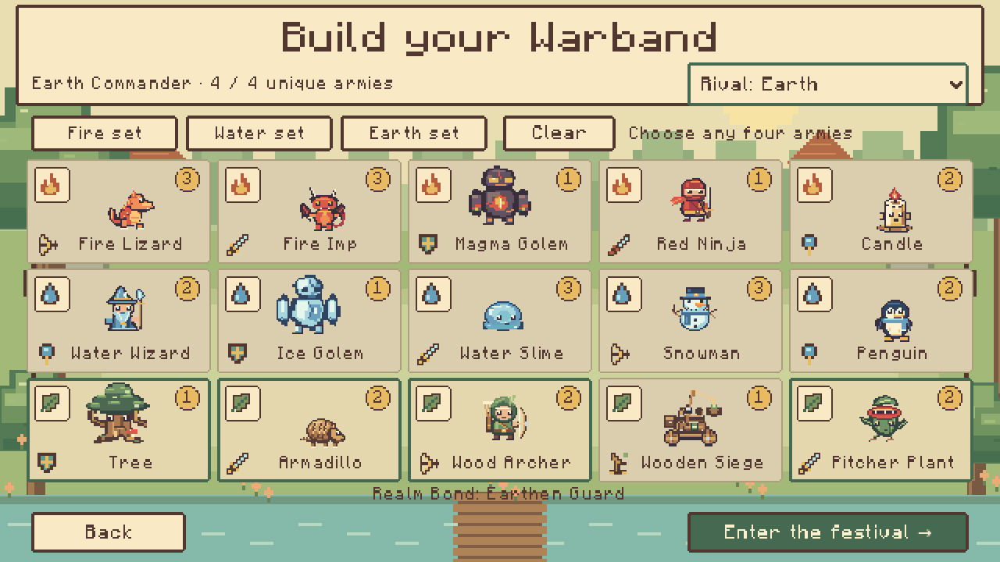
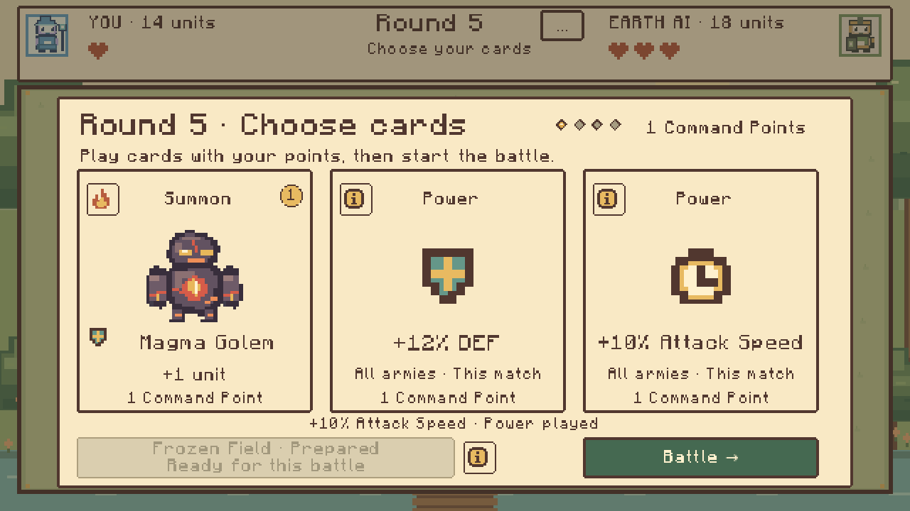

# VTuber Era

A cozy storybook drafting auto-battler at the Convergence Festival. Choose a
Fire, Water or Earth Commander and four unique armies from fifteen cards. Phase 2
adds mixed warbands, healing, shields, Slow, lifesteal and siege splash.

Commanders each have an active skill costing **1 Command Point**, once per round.
Prepare it beside the round's cards; the info button explains its effects.
**Fire** drops six AOE meteors before troops move. **Water** freezes the field,
slowing all enemies by 15% and reducing defence by 8% for the round. **Earth**
raises three walls on the enemy field. Both armies route around them, projectiles
stop on impact, and ranged units need clear line of sight before shooting.
Ice and walls last until the round ends; commander passives remain active.

Each round opens a card-selection popup. Spend Command Points on the clean card
faces, tap the top-left info icon for full army effects, then hit **Battle**.
The same card design appears in the compendium. Draft controls disappear during
combat, opening a 600×280 arena—39% more fighting space than the 600×202 layout.

Commander cards show only a portrait and their top-left info button. That button
opens their identity, passive bonuses and active skill. The warband builder shows
all fifteen portrait cards once, with the character name underneath, a role icon,
a top-left elemental info button and a numbered circle at the top right for
units per summon. Selected cards have a green border; click again to remove them.
The same army symbols appear in the compendium and round picker.

The interface uses proportional Minecraft-style lettering by Idrees Hassan.
All fifteen armies share a 32-color palette, material details and eight animation
frames. Battle sprites use three sizes, with health bars following their size:
normal 1×, large 1.5× and small 0.6×. Full Slimes are normal and split children
are small. Stepped panels and crisp viewport scaling
unify the pixel theme. Ninja teleport, contact attacks and one-use revival
remain covered by gameplay tests.

| Size | Armies |
|---|---|
| 1× | Red Ninja, Water Wizard, Snowman, Wood Archer, Pitcher Plant, full Slime |
| 1.5× | Magma Golem, Ice Golem, Tree, Wooden Siege |
| 0.6× | split Slime, Armadillo, Penguin, Candle, Fire Imp, Fire Lizard |

Uproot navigation allows bodies to slide along wall edges and choose routes
around firing allies. Walls still stop bodies, projectiles and line of sight;
the compact 7.2×7.2 collision footprint remains active for every visual size.

All fifteen army passives remain active:
projectile splash and pushback, death explosions and Slime splitting, one-use
Ninja teleport and resurrection, fire rings, ice auras, Tree healing, Armadillo attack Slow,
split arrows and huge siege blasts. Candle adds three-second burning ground,
Penguin adds stacking 5%-HP-per-second healing puddles, and Pitcher Plant pulls
backline enemies into melee range. The compendium explains each ability.
Each realm now offers five armies; choose any four. The three new armies summon
two units, capped at four Candles, four Penguins and six Pitcher Plants.
Collision stays active at 7.2×7.2 with depth-sorted sprites, a compact HUD and
twelve original combat sound effects.




**Play:** [Launch VTuber Era](https://oaklanavery-hub.github.io/vtuber-era/)
**Source:** [oaklanavery-hub/vtuber-era](https://github.com/oaklanavery-hub/vtuber-era)

## Play and controls

Choose any Commander, use a realm preset or mix four different army cards, and
choose a Mirror, Fire, Water or Earth AI rival. Four cards from one realm activate
that realm's bond, independently of your Commander. Both sides start with four
Hearts and three Command Points; the previous loser gets one comeback point.

Each point summons an offered army, reinforces an eligible army, promotes its
Rank, plays an army-wide power card, or prepares your Commander's active skill. Playing a card spends its point and
refreshes the offers inside the popup. Battle starts once you own an army; unused
points are discarded. Specials require two normal summons.
Each army type has a role cap: **ranged 8, melee 10, tanks 3, mages 5,
assassins 3, siege 4**. Summons and reinforcements fill the remaining slots and
show the exact gain before spending a point. Promotions remain available at the
cap. Separate cards of the same role have separate limits. Slime children are
temporary combat units and do not increase the persistent roster.

Power cards add **+15% HP**, **+10% Damage**, **+12% DEF**, or **+10% Attack Speed**
to all your armies for the rest of the match. Repeats add to the bonus and future
summons inherit it. Each costs **1 Command Point** and uses no unit slots.
Defence divides incoming damage by the defence multiplier; it never makes units
immune. Capped summons leave the pool, and fully capped armies draw three useful
power choices. The top-left info icon shows the current bonus and what playing
the card will add. Rematch clears all power bonuses.

Commander selection uses small **84×84** portrait squares with a top-left info
button, matching the marked layout. Their detailed effects remain behind that button.



Fire Imps explode on death with AOE damage, radial pushback and a two-second
Burn. Ice Golems carry a 48px aura that slows enemy movement and attack speed
by 15%. Red Ninjas visibly charge for two seconds, then blink behind enemy lines
once per battle; landing positions respect unit and wall collision. Their
one-use resurrection at 30% HP remains active.

Counts and Ranks persist; units return at full HP after each automatic battle.
The first side to lose all four Hearts loses. No commands are allowed in combat.

| Control | Action |
|---|---|
| Mouse / touch | Select Commanders, army cards and buttons |
| 1, 2, 3 | Choose the corresponding draft offer |
| B | Prepare your Commander's active skill before combat |
| Space | Begin battle; unused points are discarded |
| Enter | Confirm Reinforcements or advance a round dialog |
| Escape | Close card effects / cancel Reinforcements; otherwise open settings or go back |
| F3 | Show AI draft explanations |

Settings pause the visual match while open. Combat speed changes how quickly
fixed simulation ticks are displayed. Settings, Commander, warband and rival
save locally. Version 1 saves migrate automatically; ongoing matches do not save.

## Engine and editor

Use **Godot 4.5 stable**, standard GDScript build and Compatibility renderer.
The exact build is `4.5.stable.official.876b29033`.

1. Download the [Godot 4.5 standard engine](https://godotengine.org/download/archive/4.5-stable/).
2. Import `project.godot` in the project manager.
3. Press **F5**, or **F6** on `scenes/main.tscn`.

The shipping platform is the browser; editor previews are for development.

## Tests

Run from the project directory with `godot` pointing to Godot 4.5:

```sh
godot --headless --path . --editor --import --quit
godot --headless --path . --script res://tests/run_tests.gd
godot --headless --path . --script res://tests/power_card_tests.gd
godot --headless --path . --script res://tests/elemental_tests.gd
godot --headless --path . --script res://tests/passive_tests.gd
godot --headless --path . --script res://tests/garden_army_tests.gd
godot --headless --path . --script res://tests/ninja_tests.gd
godot --headless --path . --script res://tests/formation_tests.gd
godot --headless --path . --script res://tests/commander_skill_tests.gd
godot --headless --path . --script res://tests/ui_smoke.gd
```

The power runner covers all four cards, additive stacking, rank/commander bonuses,
damage passives, split/revive inheritance, capped and partial draft pools,
AI purchases, replay and fresh-match resets. The rules runner covers economy, eligibility, offers, caps, persistence, Hearts,
Fire effects, AI legality, deterministic replay, time limits and malformed saves.
The elemental runner checks all Commanders, mixed loadouts, shields, healing,
lifesteal, Slow, splash and complete deterministic matches across all nine realm
pairings. UI smoke exercises selection, real drafting, combat, results and Rematch.
All runners exit non-zero on failure. See `QA_REPORT.md` for release evidence.
The formation runner uses oversized 144-unit stress fixtures to cover crowds, duplicate-role mixed spawns, body
collision throughout movement and interpolation, allied/hostile detours, melee
contact, range-based pursuit, original stats and deterministic movement replay.
The Ninja runner covers the full two-second charge, mirrored rear landings,
wall/crowd/edge destinations, blocking defenders, real attacks from both sides,
30%-HP revival and deterministic collision-safe pursuit.
The passive runner covers the original twelve abilities, simultaneous death chains,
posthumous projectiles, one-use revivals/splits, non-stacking slows, exact damage
and healing fractions, timed auras, pushback collisions and 240-unit split crowds.
The garden army runner checks specialist caps, saved loadouts and bonds, matching
golem radii, ring damage, exact ground lifetimes, additive puddle healing,
backline targeting, collision-safe pulls and full mixed-army combat replays.
The commander skill runner checks payment, six opening impacts, AOE and death
passives, global ice and defence/shield math, wall routes, obscured ranged
repositioning, blocked fast/posthumous projectiles, safe births and knockback,
144-unit terrain collision and deterministic replays.

Optional balance sampling runs 72 full AI matches:

```sh
godot --headless --path . --script res://tests/balance_simulations.gd
```

For optional browser QA, install Playwright locally (not a game dependency):
`npm install --no-save --package-lock=false playwright`, then
`npx playwright install chromium`. After exporting, run
`node tests/browser_smoke.cjs`. Set `QA_REALM` to `fire`, `water`, `earth` or `mixed`,
and optionally `QA_RIVAL` to the opposing realm. Each scenario plays a full match,
checks saved settings/loadouts, verifies real actions and captures screenshots.
On Windows, set the variables before running Node. A development URL with `?qa=1`
enables the opt-in, read-only `window.vtuberEraQA` snapshot.

## Export the browser build

Install matching **4.5 stable export templates** through Godot's Export Template
Manager. The Web preset disables threads and GDExtensions and uses WebGL 2.
The logical resolution is 640×360 with preserved 16:9 and nearest filtering.

```sh
mkdir -p build/web
godot --headless --path . --export-release Web build/web/index.html
python3 tools/prepare_web.py
python3 tools/serve_web.py
```

Open `http://localhost:8000/vtuber-era/`. On Windows, use `python` instead of
`python3` and create `build/web` first. Serve the export over HTTP/HTTPS.
A browser with WebAssembly and WebGL 2 is required. No custom isolation headers,
account, CDN, remote asset service or JavaScript game framework is needed.

## GitHub Pages

`.github/workflows/deploy-pages.yml` installs the exact engine/templates,
verifies official SHA-512 checksums, imports, runs all eight correctness runners,
exports, checks required files, includes notices and `.nojekyll`, then deploys
through official Pages actions. Main pushes and manual dispatch trigger it.
The public game uses the existing `/vtuber-era/` project path.

## Project structure

| Folder | Responsibility |
|---|---|
| `data/` | Custom Resources: fifteen armies, three Commanders/bonds and balance |
| `simulation/` | Persistent armies, points, Hearts and seeded draft RNG |
| `drafting/` | Unique weighted offers and special eligibility |
| `combat/` | Fixed-tick movement, projectiles, splash and elemental effects |
| `ai/` | Legal scoring from frozen opponent information |
| `scenes/`, `ui/` | World/battlefield rendering, selection, cards and dialogs |
| `autoloads/` | Versioned local saves and original audio |
| `assets/` | Original atlases, three portraits, audio and licence notices |
| `tests/` | Rules, elemental, passives, formation, UI, browser and balance runners |
| `tools/` | Rebuild assets and prepare/serve exports |

## Current limits

- Placeholder portraits, pixel art and synthesized music; no final VTuber identities.
- Initial prototype balance; the AI sample does not establish competitive balance.
- No multiplayer, accounts, monetization, manual formation or native package.
- Rare simultaneous dispersal is a draw with no Heart loss. Exact timeout ties
  enter escalating sudden death.
- Capped army actions leave the pool; reusable power cards keep late-game drafts useful.
- Private browsing or storage restrictions can prevent local saves.
- Browser QA covers Chromium; Firefox, Safari and mobile validation remain.

## Licence status

**No open-source licence has been selected. Public source visibility does not
grant reuse rights.** Permission from the owner is required for project code or
original assets. Engine/font licences remain separate and are included in
`assets/` and the Web export's `THIRD_PARTY_NOTICES.txt`. See `ASSET_GUIDE.md`.
